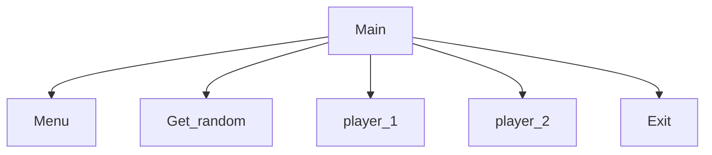

# Program Name
Gage , Alex

## <Number Guessing Game> Description
takes two inputs for names of the players and then generates a random number then the players take turns guessing the number 

### <Number guessing game> Flowchart

#### Function Diagrams

| `start new game`    |               |  Gage     |
| ------------------ | ------------- | ------------ |
| `argument:type`    | takes input from the user for there guess  |              |
| `time:integer`     | calculates weather or not it is correct  | outputs if its correct and if its not it give feedback             |

***
| `function name2`    |               |     author   |
| ------------------ | ------------- | ------------ |
| `argument:type`    | takes input from the user for ____  |              |
| `time:integer`     | calculates ______  | outputs ____             |
| `name:string`      | takes input for name ___ | returns total |
